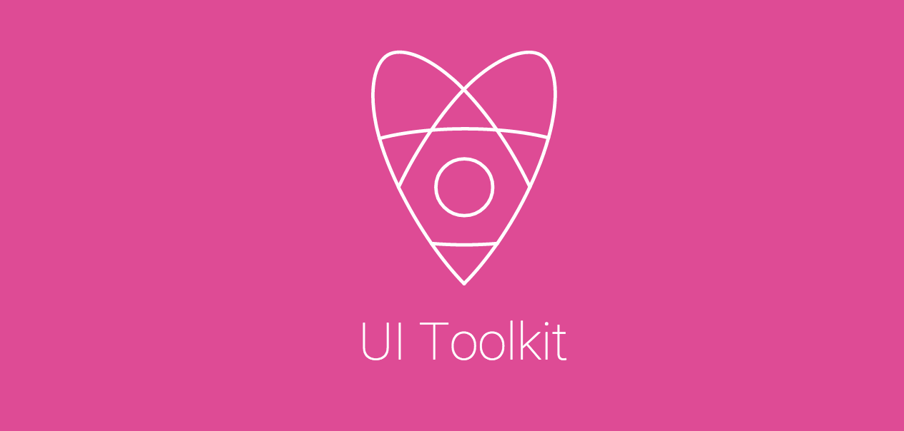

[](https://travis-ci.org/holidayextras/ui-toolkit)
[](https://gemnasium.com/holidayextras/ui-toolkit)
[](https://coveralls.io/r/holidayextras/ui-toolkit?branch=coveralls)

<header style="background: rgb(222,75,149);padding:2em;text-align:center">
  
</header>

##### Under Active Development

Requirements:
---

* [Node.js v10+](http://nodejs.org/) ( For Application Development )

UI Toolkit Usage
---

All the available UI Toolkit Components are to be listed in the `src/ui-toolkit.js` so they can be accessed via:

```jsx
var UIToolkit = require('ui-toolkit');

// Custom Components
<UIToolkit.Button />
<UIToolkit.Flag />
<UIToolkit.Rating />
<UIToolkit.Reviews />
<UIToolkit.Tile />
<UIToolkit.Image />
```

If you would like to cherry pick which components to include in your project, you can use this method:

```jsx
var Button = require('ui-toolkit').Button;
<Button />
```

Install for development
---

To install `ui-toolkit` locally for development:

```bash
git clone git@github.com:holidayextras/ui-toolkit.git
cd ui-toolkit
npm install
```

Troubleshooting
---
If you have any problems installing the ui-toolkit then please view the
[troubleshooting guide](/blob/master/TROUBLESHOOTING.md) which contains common errors and
solutions. If you cannot find your specific problem then please create a
[github issue](/../../issues)

Adding a new component
---
#### Install our [yeoman component generator](https://github.com/holidayextras/generator-ui-component)
```bash
npm install -g holidayextras/generator-ui-component
```

#### Creating the component
Generate a component & follow the prompts
```bash
cd src/components
mkdir your-new-component
cd your-new-component
yo ui-component:external
```

Then require this file in `src/ui-toolkit.js`
```javascript
// src/ui-toolkit.js
UIToolkit.YourNewComponent = require('./components/your-new-component');
```

#### Adding functionality
Add the functionality to your component in `your-new-component/code/`. For more information on this directory structure, view [the component generator documentation](https://github.com/holidayextras/generator-ui-component)

#### Adding styles
The styles are currently written in [LESS](http://lesscss.org/) and live in the `src/` directory.

You will need to create a new file for your component
```bash
cd src/less
touch _your-new-component.less
open _your-new-component.less
```

Then import this file in `src/less/toolkit.less`
```less
// src/less/toolkit.less
@import "_your-new-component";
```

Running `grunt less` will compile this to `dist/toolkit.css`

#### Viewing your component in the browser
There are two ways you can view your component:

1. In the documentation
2. Standalone (currently doesn't bring in ui-toolkit styles)

##### In the documentation
_Note: This needs to and will be be simplified_

1. In `./docs/examples/`, create a new jsx file that describes your component. e.g.
```jsx
// docs/examples/YourNewComponent.jsx
var example = (
  <UIToolkit.YourNewComponent foo="bar" />
);
React.render(example, mountNode);
```

2. Then add a link to the navigation in `.docs/src/Nav.jsx`.
3. In `./docs/src/Components.jsx`, add a new `<article>`, similar to the existing ones e.g.

```jsx
<article>
  <h3 id="your-new-component">Your new component</h3>
  <p>Your new component description</p>
  <CustomComponent codeText={fs.readFileSync(__dirname + '/../examples/YourNewComponent.jsx', 'utf8')} />
</article>
```

4. You should now be able to see your component when running `grunt docs` from the root of `ui-toolkit`

##### Standalone (currently doesn't bring in ui-toolkit styles)
```bash
cd src/components/your-new-component
npm run build-dev
```
Browserify bundles from the `dev/example.jsx`. Loading the `dev/index.html` in your browser will display the component.

UI Toolkit Themes
---
A collection of custom themes for UI Toolkit are coming soon.

Component Documentation
---

You can view the React Components in your browser by generating and viewing the docs:

Run & watch the documentation in development:
```bash
grunt docs
```

Building so you can upload to a remote docs server that does not require Node:
```bash
grunt docs-build
```

You will only need to upload the following static assets once generated:

+ assets/
+ vendor/
+ index.html

Grunt Terminal Commands:
---

#### THIS SECTION IS A WORK IN PROGRESS

You can use the following build commands via terminal:

#### Build for Distribution:

The following command will compile Less Styles into a CSS and Concat JS files for Distribution.

This is the most common command you will want to use and is required to view any changed you made in a browser or simulator.

```bash
grunt build
```

#### Create a Major Release:

The following will:

1. Increase the build's major number ( e.g. v __1__.2.3 => v __2__.0.0 )
2. Build & Package Distribution Files
3. Create Tag Branch & Perform a git commit
4. Generated Documentation will be merged into `gh-pages`

```bash
grunt release-major
```

#### Create a Minor Release:

The following will:

1. Increase the build's minor number ( e.g. v 1.__2__.3 => v 1.__3__.0 )
2. Build & Package Distribution Files
3. Create Tag Branch & Perform a git commit
4. Generated Documentation will be merged into `gh-pages`

```bash
grunt release-minor
```

#### Create a Release Patch:

The following will:

1. Increase the build's patch number ( e.g. v 1.2.__3__ => v 1.2.__4__ )
2. Build & Package Distribution Files
3. Create Tag Branch & Perform a git commit
4. Generated Documentation will be merged into `gh-pages`

```bash
grunt release-patch
```
