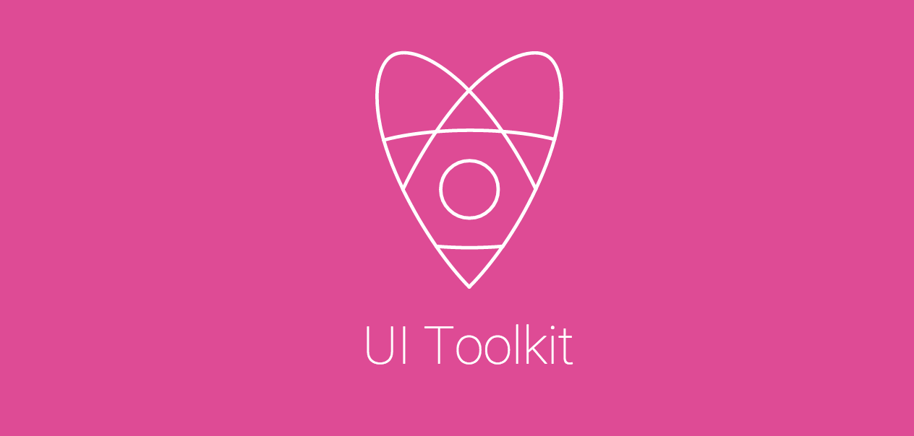

[](https://travis-ci.org/holidayextras/ui-toolkit)
[](https://circleci.com/gh/holidayextras/ui-toolkit)
[](https://gemnasium.com/holidayextras/ui-toolkit)
[](https://coveralls.io/github/holidayextras/ui-toolkit?branch=master)

<header style="background: rgb(222,75,149);padding:2em;text-align:center">
  
</header>

##### Under Active Development

Requirements:
---

* [Node.js v10+](http://nodejs.org/) ( For Application Development )

UI Toolkit Usage
---

All the available UI Toolkit Components are to be listed in the `dist/index.js` so they can be accessed via:

```jsx
var UIToolkit = require('ui-toolkit');

// Custom Components
<UIToolkit.Button />
<UIToolkit.Flag />
<UIToolkit.Rating />
<UIToolkit.Reviews />
<UIToolkit.Tile />
<UIToolkit.Image />
<UIToolkit.Input />
```

If you would like to cherry pick which components to include in your project, you can use this method:

```jsx
var Button = require('ui-toolkit').Button;
<Button />
```
*please note this still includes the entire ui-toolkit*

Install for development
---

To install `ui-toolkit` locally for development:

```bash
git clone git@github.com:holidayextras/ui-toolkit.git
cd ui-toolkit
npm install
```

Troubleshooting
---
If you have any problems installing the ui-toolkit then please view the
[troubleshooting guide](/blob/master/TROUBLESHOOTING.md) which contains common errors and
solutions. If you cannot find your specific problem then please create a
[github issue](/../../issues)

Adding a new component
---
#### Creating the component
Generate a component & follow the prompts
```bash
cd src/components
mkdir your-new-component
cd your-new-component
```

Then require this file in `dist/index.js`
```javascript
// dist/index.js
UIToolkit.YourNewComponent = require('./components/your-new-component');
```

#### Adding functionality
Add the functionality to your component in `your-new-component/your-new-component.jsx`.

#### Adding styles
The styles are currently written in [LESS](http://lesscss.org/) and live in the component directory.

You will need to create a new file for your component
```bash
cd src/less
touch _your-new-component.less
open _your-new-component.less
```

Then import this file in `src/less/toolkit.less`
```less
// src/less/toolkit.less
@import "_your-new-component";
```

Running `grunt less` will compile this to `dist/toolkit.css`

#### Viewing your component in the browser
There are two ways you can view your component:

1. In the documentation
2. Standalone (currently doesn't bring in ui-toolkit styles)

##### In the documentation
_Note: This needs to and will be be simplified_

1. In `./docs/examples/`, create a new jsx file that describes your component. e.g.
```jsx
// docs/examples/YourNewComponent.jsx
var example = (
  <UIToolkit.YourNewComponent foo="bar" />
);
ReactDOM.render(example, mountNode);
```

2. Then add a link to the navigation in `.docs/src/Nav.jsx`.
3. In `./docs/src/Components.jsx`, add a new `<article>`, similar to the existing ones e.g.

```jsx
<article>
  <h3 id="your-new-component">Your new component</h3>
  <p>Your new component description</p>
  <CustomComponent codeText={fs.readFileSync(__dirname + '/../examples/YourNewComponent.jsx', 'utf8')} />
</article>
```

4. You should now be able to see your component when running `npm run docs` from the root of `ui-toolkit`

##### Standalone (currently doesn't bring in ui-toolkit styles)
```bash
cd src/components/your-new-component
npm run build-dev
```
Browserify bundles from the `dev/example.jsx`. Loading the `dev/index.html` in your browser will display the component.

UI Toolkit Themes
---
A collection of custom themes for UI Toolkit are coming soon.

Component Documentation
---

You can view the React Components in your browser by generating and viewing the docs:

Run & watch the documentation in development:
```bash
npm run docs
```

Building so you can upload to a remote docs server that does not require Node:
```bash
grunt docs-build
```

You will only need to upload the following static assets once generated:

+ assets/
+ vendor/
+ index.html

Creating a release:
---

To create a new release of the ui-toolkit you need to bump the version number in the package.json file, once you PR is merged in this will create a new release on github and push the changes to aws automatically. You will then have to manually publish the changes to npm. This procedure is the same for both minor and major releases.

